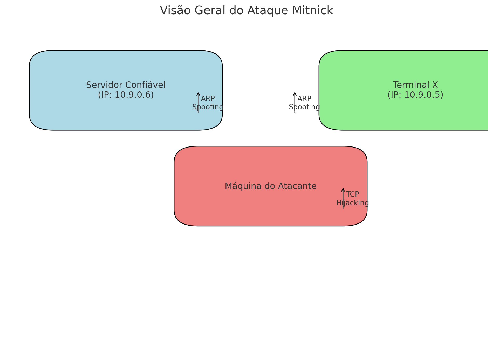

# Documentation of the Mitnick Attack Reproduction Script in LAN

## Overview

This project in ***Python*** aims to simulate the **Mitnick attack** on a Local Area Network (LAN). The attack involves ARP spoofing to poison the ARP table of the **Trusted Server(IP: 10.9.0.6)** and **X_terminal(10.9.0.5)** machines, and then forge a TCP connection with **X_terminal(10.9.0.5)** impersonating the **Trusted Server(IP: 10.9.0.6)** to send a packet that includes the string **"+ +"** in the **/root/.rhosts** file of the **X_terminal**, allowing any machine to connect.



### Script Components
The script is divided into several functions, each performing a specific task necessary to execute the Mitnick attack. The file is divided into sections:
- In the [**Reproduction Steps**](#reproduction-steps) section, it is described how to reproduce the attack step-by-step.
- In the [**Functions**](#functions) section, a detailed explanation of each function and the main execution flow is provided.
- In the [**Main Execution Flow**](#main-execution-flow-main) section, the step-by-step execution of the script's **main** function is described.
- In the [**Notes**](#notes) section, there are additional notes about this project.

## Reproduction Steps

### First of all...

After [**Building and starting the containers**], it is extremely important and necessary that the **/root.rhosts** file contains the following content **before** running the script:

```
10.9.0.6 +
```

If it does not contain it, follow the step of [**Accessing the victim container (X_terminal)**], and manually add the string `10.9.0.6` to the file.

1. **Environment Setup:**
   - Use the configured Docker environment (**`./image_ubuntu_mitnick/Dockerfile`** and **`./docker-compose.yml`**).
   - Ensure Docker is installed on the system by running:
   ```
   $ docker --version
   ```
   - If the output is something like this, Docker is installed:
   ```
   # Docker version 27.0.3, build 7d4bcd863a
   ```
   - Ensure the `scapy` library is installed by running:
   ```
   $ python -c "import scapy; print(scapy.__version__)"
   ```
   - If the output is something like this, the `scapy` library is installed:
   ```
   # 2.5.0
   ```

2. **Execution:**
   - Navigate to the `MITNICK_ATTACK_LAB` directory:
   ```
   cd MITNICK_ATTACK_LAB
   ```
   - Build and start the Docker containers in a terminal:
   ```
   $ docker-compose up --build
   ```
   - Open a new terminal and access the attacker's container (**`seed-attacker`**):
   ```
   $ docker exec -it seed-attacker bash
   ```
   - Navigate to the `volumes` directory:
   ```
   cd /volumes
   ```
   - Run the script:
   ```
   # python3 main.py
   ```
   - The script will print **status** messages indicating the progress of the attack.

3. **Verification**
   
   - To verify the script was successful, access the victim container (**`x_terminal`**):
   ```
   $ docker exec -it x-terminal-10.9.0.5 /bin/bash
   ```
   - Access the **`/root/.rhosts`** file with:
   ```
   # cat /root/.rhosts
   ```
   - The output should be something like this, indicating the attack was successful:
   ```
   10.9.0.6 +
   + +
   ```
   - Then run the following command from the attacker's container (**`seed-attacker`**) to directly access the victim's machine:
   ```
   rsh -l root 10.9.0.5
   ```

4. **Additional:**
   - The attack can be stopped manually at any time by pressing `(Ctrl+C)`.
   - To access the server container (**`trusted_server`**), run the following command with the Docker containers already built and started:
   ```
   $ docker exec -it trusted-server-10.9.0.6 /bin/bash
   ```
   - To monitor TCP traffic on any of the machines while the script is running, execute:
   ```
   tcpdump tcp -s0 -A -n
   ```

## Functions

### 1. `get_mac(ip_address="10.9.0.1")`

Retrieves the MAC address for a given IP address.

- **Parameters:**
  - `ip_address (str)`: The IP address for which the MAC address should be retrieved. The default is "10.9.0.1".

- **Logic:**
  - If the IP address is "10.9.0.1", it uses the `ifconfig` command to find the MAC address.
  - For other IP addresses, it sends a ping to the address to populate the ARP table and then retrieves the MAC address using the `arp` command.

### 2. `arp_spoof(target_ip, target_mac, spoof_ip, attacker_mac)`

Sends ARP packets to associate a destination IP address with the attacker's MAC address.

- **Parameters:**
  - `target_ip (str)`: The IP address to be spoofed.
  - `target_mac (str)`: The actual MAC address of the target IP.
  - `spoof_ip (str)`: The IP address to be associated with the attacker's MAC.
  - `attacker_mac (str)`: The attacker's MAC address.

- **Logic:**
  - Creates an ARP response packet and sends it in a loop to maintain the spoofing.

### 3. `tcp_hijack(server_ip="10.9.0.6", terminal_ip="10.9.0.5", src_port=1023, dst_port=514, sequence=1000)`

Initiates a TCP connection by sending a SYN packet and completing the 3-way handshake.

- **Parameters:**
  - `server_ip (str)`: The IP address of the trusted server.
  - `terminal_ip (str)`: The IP address of the X terminal.
  - `src_port (int)`: Source port for the TCP connection.
  - `dst_port (int)`: Destination port for the TCP connection.
  - `sequence (int)`: Initial sequence number for the TCP packets.

- **Logic:**
  - Sends a SYN packet to initiate the TCP handshake.
  - Receives the SYN-ACK packet
  - Sends an ACK packet to complete the handshake.

### 4. `rsh_connection(server_ip="10.9.0.6", terminal_ip="10.9.0.5", src_port=1023, dst_port=514, sequence=None, isn=None)`

Sends a packet with the string "+ +" so that any machine can subsequently establish an RSH connection on the X terminal.

- **Parameters:**
  - `server_ip (str)`: The IP address of the trusted server.
  - `terminal_ip (str)`: The IP address of the X terminal.
  - `src_port (int)`: Source port for the TCP connection.
  - `dst_port (int)`: Destination port for the TCP connection.
  - `sequence (int)`: Sequence number for the TCP packets.
  - `isn (int)`: Initial sequence number from the SYN-ACK packet.

- **Logic:**
  - Sends a payload that adds "+ +" to the `.rhosts` file on the X terminal to allow root access.

## Main Execution Flow: `main()`

Coordinates the execution of the Mitnick attack by calling the necessary functions in sequence.

1. **Setup:**
   - Defines IP addresses and ports for the trusted server and the X terminal.
   - Disables IP forwarding on the attacker's machine.

2. **MAC Address Retrieval:**
   - Retrieves the attacker's MAC address.
   - Retrieves the MAC addresses of the trusted server and the X terminal.

3. **ARP Spoofing:**
   - Spoofs the ARP tables of the trusted server and the X terminal to associate them with the attacker's MAC address.

4. **TCP Forging:**
   - Establishes a TCP connection by completing the 3-way handshake.

5. **RSH Packet Sending:**
   - Sends the payload to the X terminal to modify the `.rhosts` file, allowing root access from **any machine**.

## Notes

- This script is for educational purposes only and **should not** be used for malicious activities.
- Ensure you have permission to perform such an attack in your testing environment.
- Proper network monitoring and security measures should be in place to detect and prevent ARP spoofing and TCP hijacking attacks.