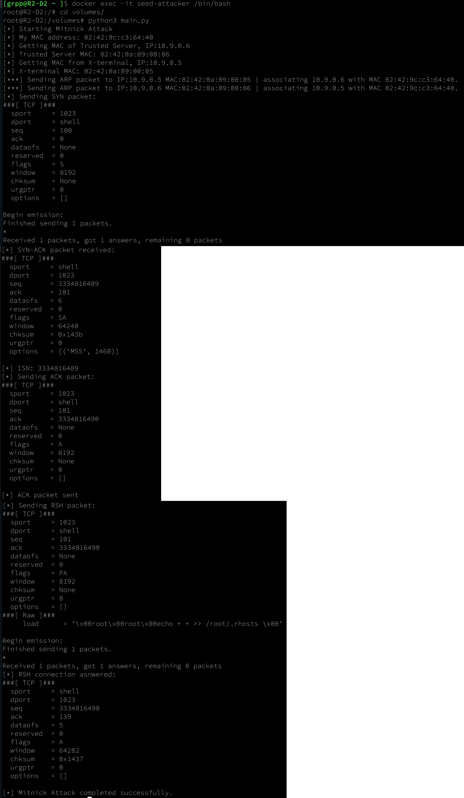
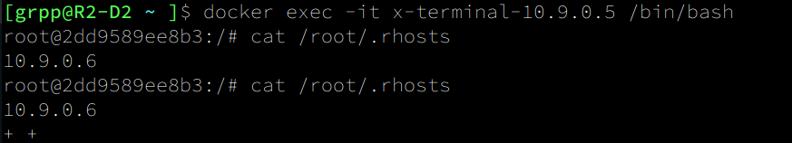
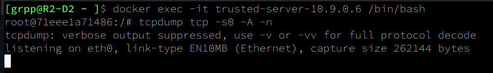

# Documentação do Script de Reprodução do Ataque Mitnick em LAN
## Visão Geral
Este projeto em ***Python*** busca simula o **ataque Mitnick** em uma Rede Local (LAN).
O ataque envolve ARP spoofing para envenenar a tabela ARP das máquinas **Trusted Server(IP: 10.9.0.6)** e **X_terminal(10.9.0.5)**, e então forjar uma conexão TCP com **X_terminal(10.9.0.5)** se passando pelo **Trusted Server(IP: 10.9.0.6)** para enviar um pacote que tem como conteúdo incluir a string **"+ +"** no arquivo **/root/.rhosts** do **X_terminal**, permitindo que qualquer máquina se conecte.


### Componentes do Script
O script é dividido em várias funções, cada uma realizando uma tarefa específica necessária para executar o ataque Mitnick. 
O arquivo presente está separado em seções:
- Na sessão [**Passos para Reprodução**](#passos-para-reprodução) está descrito como reproduzir o ataque passo-a-passo
- Na sessão [**Funções**](#funções) está uma explicação detalhada de cada função e do fluxo de execução principal.
- Na sessão [**Fluxo de Execução Principal**](#fluxo-de-execução-principal-main) está descrito o passo-a-passo de execução da função **main** do script.
- Na sessão [**Notas**](#notas), estão notas de ressalva deste projeto

## Passos para Reprodução
### Antes de tudo...
Depois de [**Construir e iniciar os contêiners**], é de extrema importância e necessidade que o arquivo **/root.rhosts** contenha o seguinte conteúdo **antes** da execução do Script:
```
10.9.0.6 +
```
Caso não contenha, execute o passo de [**Acessar o contêiner da vítima(X_terminal)**], e adicione manualmente a string `10.9.0.6` ao arquivo.
1. **Configuração do Ambiente:**
   - Utilize o ambiente Docker configurado(**`./image_ubuntu_mitnick/Dockerfile`** e **`./docker-compose.yml`**). 
   - Certifique-se de que o Docker está instalado no sistema, basta executar:
   ```
   $ docker --version
   ```
    - Caso a saída seja algo do tipo, o Docker está instalado:
    ```
    # Docker version 27.0.3, build 7d4bcd863a
    ```
   - Assegure que a biblioteca `scapy` está instalada, para isso basta rodar:
   ```
   $ python -c "import scapy; print(scapy.__version__)"
   ```
   - Caso a saída seja algo do tipo, a biblioteca `scapy` está instalada:
   ```
   # 2.5.0
   ```

2. **Execução:**
   - Navegue até o diretório `MITNICK_ATTACK_LAB`:
   ```
   cd MITNICK_ATTACK_LAB
   ```
   - Construa e inicie os contêiners Docker em um terminal:
    ```
   $ docker-compose up --build
   ```
   - Abra um novo terminal, e nesse terminal acesse o contêiner do invasor (**`seed-attacker`**):
   ```
   $ docker exec -it seed-attacker bash
   ```
   - Navegue até o diretório `volumes`:
   ```
   cd /volumes
   ```
   - Execute o script:
   ```
   # python3 main.py
   ```
   - O script imprimirá mensagens de **status** indicando o progresso do ataque.

3. **Verificação**
   
   - Para verificar que o script foi bem sucedido, acesse o contâiner da vítima (**`x_terminal`**):
   ```
   $ docker exec -it x-terminal-10.9.0.5 /bin/bash
   ```
   - Acesse o arquivo **`/root/.rhosts`** com:
   ```
   # cat /root/.rhosts
   ```
   - A saída deverá ser algo do tipo, indicando que o ataque foi realizado com sucesso:
   ```
   10.9.0.6 +
   + +
   ```
   - Com isso basta rodar o comando a seguir do contêiner do invasor (**`seed-attacker`**) para acessar a máquina da vítima diretamente:
   ```
   rsh -l root 10.9.0.5
   ```

4. **Adicionais:**
   - O ataque pode ser interrompido manualmente a qualqer momento basta pressionar `(Ctrl+C)`.
   - Caso queira acessar o contêiner do servidor (**`trusted_server`**), execute o seguinte comando com os contêiners Docker já construidos e iniciados:
   ```
   $ docker exec -it trusted-server-10.9.0.6 /bin/bash
   ```
   - Caso queira verificar o tráfego de pacotes **TCP** em qualquer uma das máquinas, paralelamente a execução do script, execute:
   ```
   tcpdump tcp -s0 -A -n
   ```

## Funções
### 1. `get_mac(ip_address="10.9.0.1")`
Recupera o endereço MAC para um determinado endereço IP.
- **Parâmetros:**
  - `ip_address (str)`: O endereço IP para o qual o endereço MAC deve ser recuperado. O padrão é "10.9.0.1".

- **Lógica:**
  - Se o endereço IP for "10.9.0.1", ele usa o comando `ifconfig` para encontrar o endereço MAC.
  - Para outros endereços IP, ele envia um ping para o endereço para popular a tabela ARP e então recupera o endereço MAC usando o comando `arp`.

### 2. `arp_spoof(target_ip, target_mac, spoof_ip, attacker_mac)`
Envia pacotes ARP para associar um endereço IP de destino ao endereço MAC do invasor.
- **Parâmetros:**
  - `target_ip (str)`: O endereço IP a ser falsificado.
  - `target_mac (str)`: O endereço MAC real do IP de destino.
  - `spoof_ip (str)`: O endereço IP a ser associado ao MAC do invasor.
  - `attacker_mac (str)`: O endereço MAC do invasor.

- **Lógica:**
  - Cria um pacote de resposta ARP e o envia em um loop para manter a falsificação.

### 3. `tcp_hijack(server_ip="10.9.0.6", terminal_ip="10.9.0.5", src_port=1023, dst_port=514, sequence=1000)`
Inicia uma conexão TCP enviando um pacote SYN e completando o 3-way handshake.
- **Parâmetros:**
  - `server_ip (str)`: O endereço IP do servidor confiável.
  - `terminal_ip (str)`: O endereço IP do terminal X.
  - `src_port (int)`: Porta de origem para a conexão TCP.
  - `dst_port (int)`: Porta de destino para a conexão TCP.
  - `sequence (int)`: Número de sequência inicial para os pacotes TCP.

- **Lógica:**
  - Envia um pacote SYN para iniciar o handshake TCP.
  - Recebe o pacote SYN-ACK
  - Envia um pacote ACK para completar o handshake.

### 4. `rsh_connection(server_ip="10.9.0.6", terminal_ip="10.9.0.5", src_port=1023, dst_port=514, sequence=None, isn=None)`
Envia um pacote com a string "+ +" para que posteriormente qualquer máquina possa estabelecer uma conexão RSH no X_terminal.
- **Parâmetros:**
  - `server_ip (str)`: O endereço IP do servidor confiável.
  - `terminal_ip (str)`: O endereço IP do terminal X.
  - `src_port (int)`: Porta de origem para a conexão TCP.
  - `dst_port (int)`: Porta de destino para a conexão TCP.
  - `sequence (int)`: Número de sequência para os pacotes TCP.
  - `isn (int)`: Número de sequência inicial do pacote SYN-ACK.

- **Lógica:**
  - Envia um payload que adiciona "+ +" ao arquivo `.rhosts` no terminal X para permitir acesso root.

## Fluxo de Execução Principal: `main()`
Coordena a execução do ataque Mitnick chamando as funções necessárias em sequência.
1. **Configuração:**
   - Define os endereços IP e portas para o servidor confiável e o terminal X.
   - Desativa o encaminhamento de IP na máquina do invasor.

2. **Recuperação de Endereços MAC:**
   - Recupera o endereço MAC do invasor.
   - Recupera os endereços MAC do servidor confiável e do terminal X.

3. **ARP Spoofing:**
   - Falsifica as tabelas ARP do servidor confiável e do terminal X para associá-los ao endereço MAC do invasor.

4. **Forjamento TCP:**
   - Estabelece uma conexão TCP completando o 3-way handshake.

5. **Envio de Pacote RSH:**
   - Envia o payload para o terminal X para modificar o arquivo `.rhosts`, permitindo acesso root de **qualquer máquina**.

## Imagens Execução
### seed-attacker


### x_terminal


### trusted_server



## Notas
- Este script é apenas para fins educacionais e **não** deve ser usado para atividades maliciosas.
- Certifique-se de ter permissão para realizar tal ataque em seu ambiente de teste.
- Medidas de segurança e monitoramento de rede adequadas devem estar em vigor para detectar e prevenir ataques de spoofing ARP e sequestro de TCP.